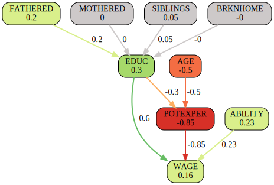

# An Application of Causing: Education and Wages

This case study is based on research and data from Gary Koop and Justin L. Tobias, "Learning about Heterogeneity in Returns to Schooling", Journal of Applied Econometrics, Vol. 19, No. 7, 2004, pp. 827-849. It is from the empirical education literature.

See [Koop, Tobias (2004) "Learning about Heterogeneity in Returns to Schooling"](https://www.economics.uci.edu/files/docs/workingpapers/2001-02/Tobias-07.pdf).

This panel data set consists of 17,919 observations from N=2,178 individuals. It contains the wage earnings history for young workers in the U.S. from 1979 until 1993. The data are taken from the National Longitudinal Survey of Youth (NLSY).

See [Koop, Tobias (2004) Labor Market Experience Data](http://people.stern.nyu.edu/wgreene/Econometrics/PanelDataSets.htm).

# The Data

The NLSY is a rich panel study of 12,686 individuals in total ranging in
age from 14-22 as of the first interview date in 1979. It contains detailed
information on the earnings and wages, educational attainment, family
characteristics, and test scores of the sampled individuals.

Koop and Tobias (2004) use a version of the NLSY which allows one to obtain an earnings history until 1993. To abstract from selection issues in employment, and to remain consistent with the majority of the literature, they focus on the outcomes of white males in the NLSY. They restrict attention to those individuals who are active in the labor force for a good portion of each year, being at least 16 years of age in the given year, who reported working at least 30 weeks a year and at least 800 hours per year. They also deleted observations when the reported hourly wage is less than $1 or greater than $100 per hour, when education decreases across time for an individual, or when the reported change in years of schooling over time is not consistent with the change in time from consecutive interviews. As such, they are careful to delete individuals whose education is clearly mismeasured.   

The dataset contains the following variables in this order, the variables 0. to 4. being time-varying and variables 5. to 9. being time-invariant:

0. PERSONID = Person id (ranging from 1 to 2,178)                           # not used by us
1. EDUC = Education (years of schooling)
2. LOGWAGE  = Log of an hourly wage, at the most recent job in 1993 dollars # we do not take log
3. POTEXPER = Potential experience (= AGE - EDUC - 5)
4. TIMETRND = Time trend (starting at 1 in 1979 and incrementing by year)   # not used by us
5. ABILITY = Ability (cognitive ability measured by test score)
6. MOTHERED = Mother's education (highest grade completed, in years)
7. FATHERED = Father's education (highest grade completed, in years)
8. BRKNHOME = Dummy variable for residence in a broken home at age 14
9. SIBLINGS = Number of siblings

The standardized test score is constructed from the 10 component tests of the Armed Services Vocational Aptitude Battery (ASVAB) administered to the NLSY participants in 1980. Since individuals varied in age, each of the 10 tests are first residualized on age, and the test score is defined as the first principal component of the standardized residuals.

Koop and Tobias (2004) analyze the reduced form since heterogeneity in the reduced form will be of the identical form as that in the structural form. In contrast, we are interested in structural causal relations. Since heterogeneity across individuals is not in our focus we ignore the person's id. Further, we do not use the time dimension and therefore ignore the time trend. We reconstruct the AGE variable from the definition of POTEXPER = AGE - EDUC - 5 and use it as an exogenous variable.

To estimate the effects, the Causing method always uses demeaned data. Just for the estimation of the bias terms, the original level data are used.

# The Model

The model comprises just three equations (EDUC, POTEXPER, LOGWAGE). There are six exogenous variables (FATHERED, MOTHERED, SIBLINGS, BRKNHOME, ABILITY, AGE). All variables are observed, there are no latent variables. Our final variable of interest are the hourly wages. The parameter signs are based on domain knowledge and their values are set to be roughly consistent with the data. The model effects are used as starting values for estimation.

1. Education is a constant plus a positive effect for parents having been schooled for more than 12 years. Negative effects are expected in the case of siblings or a broken home.

   ```python
    EDUC = 13
           + 0.1 * (FATHERED - 12)
           + 0.1 * (MOTHERED - 12)
           - 0.1 * SIBLINGS
           - 0.5 * BRKNHOME
   ```

2. Potential experience simply are the years after schooling as defined by Koop and Tobias (2004).

   `POTEXPER = Max(AGE - EDUC - 5, 0)`

3. Logarithmic hourly wages are a base constant plus positive effects from education, potential experience, and ability.

   `WAGE = 7 + 1 * (EDUC - 12) + 0.5 * POTEXPER + 1 * ABILITY`

We expect education to increase by 0.1 years if the father's education increases by one year. The same should hold for the mother's education. Each sibling is expected to reduce the duration of education by 0.1 years on average. If the young worker was raised in a broken home, we expect the education to be half a year shorter on average.

Note that the equation constants just model the level forecasts, but they do not affect the effects, being derivatives independent of constants. Also note, that in SymPy some operators are special, e.g. Max() instead of max(). The observed potential experience is never negative, but this could occur
in the estimation/optimization algorithm. 

See the [full model source code](https://github.com/realrate/Causing/blob/develop/causing/examples/models.py#L79-L160).

# Results

This is the causal graph for the Individual Mediation Effects (IME). The total effects of a variable on WAGE are shown in the corresponding nodes of the graph. These total effects are split up over their outgoing edges, yielding the mediation effects shown on the edges. However, just education has more than one outgoing edge to be interpreted in this way.



We have a look at a single individual. Just for exposition, we analyze the mediation effects of individual/observation no. 32. This worker is aged 25 and his strongest disadvantage is being so young and having low potential experience, reducing his wage by 52 Cents. However, he showed high ability in his test scores (+39 Cents). And due to his father's long schooling (16 years instead of the average of 12 years), his education is also above average (13.2 years instead of 12.6 years in the median). In total, this worker achieves an hourly wage being 20 Cents above average. 

The total effect of education is decomposed into two different antagonistic direct effects. The positive effect is directly passed to wage but the negative effect is passed to potential experience. This effect is negative because longer education means shorter potential experience. In total, the net effect is positive, increasing wages by 34 Cents per hour. The graph allows us to distinguish between the different antagonistic causes. 

The observed exogenous and predicted endogenous variables for individual no. 32 are summarized in the following table, sorted by their total effect on WAGE:

Variable | Individual no. 32 | Median | Total Effect on WAGE
--- | --- | --- | ---
ABILITY | 0.44 | 0.21 | +0.39
EDUC | 13.20 | 12.60 | +0.34
FATHERED | 16.00 | 12.00 | +0.21
WAGE | 12.04 | 11.88 | +0.20
SIBLINGS | 2.00 | 3.00 | +0.06
BRKNHOME | 0.00 | 0.00 | 0.04
MOTHERED | 12.00 | 12.00 | 0.03
AGE | 25.00 | 26.00 | -0.52
POTEXPER | 6.80 | 8.50 | -0.86

This concludes the example usage of the Causing method with real-world data. We analyzed how wages earned by young American workers are determined by their educational attainment, family characteristics, and test scores. 
