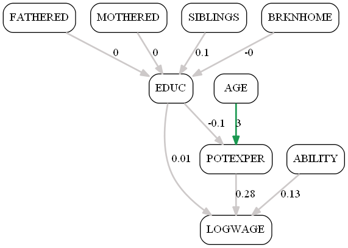
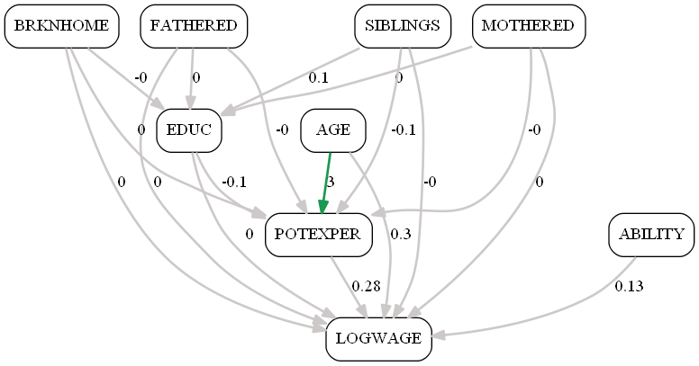
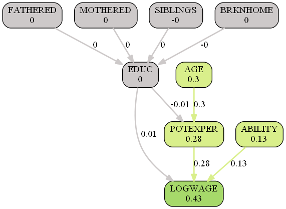

# A Real World Example: Education and Wages for Young Workers

This cse study is based on research and data from
Gary Koop and Justin L. Tobias, "Learning about Heterogeneity in Returns
to Schooling", Journal of Applied Econometrics, Vol. 19, No. 7, 2004,
pp. 827-849. It is from the empirical education literature.

See [Koop, Tobias (2004) "Learning about Heterogeneity in Returns to Schooling"](https://www.economics.uci.edu/files/docs/workingpapers/2001-02/Tobias-07.pdf).

This panel data set consists of 17,919 observations from N=2,178
individuals. It contains the wage earnings history for young workers in
the U.S. from 1979 until 1993. The data are taken from the National
Longitudinal Survey of Youth (NLSY).

See [Koop, Tobias (2004) Labor Market Experience Data](http://people.stern.nyu.edu/wgreene/Econometrics/PanelDataSets.htm).

# The Data

The NLSY is a rich panel study of 12,686 individuals in total ranging in
age from 14-22 as of the first interview date in 1979. It contains detailed
information on the earnings and wages, educational attainment, family
characteristics, and test scores of the sampled individuals.

Koop and Tobias (2004) use a version of the NLSY which allows to obtain an
earnings history until 1993. To abstract from selection issues in
employment, and to remain consistent with the majority of the literature,
they focus on the outcomes of white males in the NLSY. They restrict
attention to those individuals who are active in the labor force for a good
portion of each year, being at least 16 years of age in the given year, who
reported working at least 30 weeks a year and at least 800 hours per year.
They also deleted observations when the reported hourly wage is less than
$1 or greater than $100 dollars per hour, when education decreases across
time for an individual, or when the reported change in years of schooling
over time is not consistent with the change in time from consecutive
interviews. As such, they are careful to delete individuals whose education
is clearly mis-measured.   

The dataset contains following variables in this order, the variables 0. to 4.
being time varying and variables 5. to 9. being time invariant:

0. PERSONID = Person id (ranging from 1 to 2,178)                           # not used by us
1. EDUC = Education (years of schooling)
2. LOGWAGE  = Log of hourly wage, at most recent job in 1993 dollars        # we do not take log
3. POTEXPER = Potential experience (= AGE - EDUC - 5)
4. TIMETRND = Time trend (starting at 1 in 1979 and incrementing by year)   # not used by us
5. ABILITY = Ability (cognitive ability measured by test score)
6. MOTHERED = Mother's education (highest grade completed, in years)
7. FATHERED = Father's education (highest grade completed, in years)
8. BRKNHOME = Dummy variable for residence in a broken home at age 14
9. SIBLINGS = Number of siblings

The standardized test score is constructed from the 10 component tests of the
Armed Services Vocational Aptitude Battery (ASVAB) administered to the NLSY
participants in 1980. Since individuals varied in age, each of the 10 tests is
first residualized on age, and the test score is defined as the first principal
component of the standardized residuals.

Koop and Tobias (2004) analyze the reduced form since heterogeneity in the
reduced form will be of the identical form as that in the structural form.
In contrast, we are interested in the structural causal relations. 
Since heterogeneity across inividuals is not in our focus we ignore the
person id. Further, we do not use the time dimension and
therefore ignore the time tremd. We reconsruct the AGE variable from the
definition of POTEXPER = AGE - EDUC - 5 and use it as an exogenous variable.

To estimate the effects, the Causing method always uses demeaned data.
Just for the estimation of the bias terms the original level data are used.

# The Model

The model comprises just three equations (EDUC, POTEXPER, LOGWAGE). 
There are six exogenous variables (FATHERED, MOTHERED, SIBLINGS, BRKNHOME,
ABILITY, AGE). The paramter signs are based on domain
knowledge and their values are set to be roughly consistent with the data.

1. Education is a constant plus a positive effect for parents havings been
schooled for more than 12 years. Negative effects are expected in the case of
siblingsor a broken home.

2. Potential experience simply are the years after schooling as defined by
Koop and Tobias (2004).

3. Logarithmic hourly wages are a base constant plus possitive effects from
education, potential experience and ability.

Since estimating the regularization parameter for the 17,919 observations is a
computational intensive task taking about 15 minutes, we estimed alpha once
and pass it via the model data.

All variables are observed, there are no latent variables.
Out final variable of interest are the wages.

Note that in Sympy some operators are special, e.g. Max() instead of max().

```python
def education():
    """Education"""

    (FATHERED, MOTHERED, SIBLINGS, BRKNHOME, ABILITY, AGE, EDUC, POTEXPER, WAGE) = symbols(
        ["FATHERED", "MOTHERED", "SIBLINGS", "BRKNHOME", "ABILITY", "AGE", "EDUC", "POTEXPER", "WAGE"])
    
    # note that in Sympy some operators are special, e.g. Max() instead of max()
    from sympy import Max

    def define_equations(FATHERED, MOTHERED, SIBLINGS, BRKNHOME, ABILITY, AGE):
        
        eq_EDUC = 12 + 0.1 * (FATHERED - 12) + 0.1 * (MOTHERED - 12) - 0.05 * SIBLINGS - 0.05 * BRKNHOME
        eq_POTEXPER = Max(AGE - EDUC - 5, 0)
        eq_WAGE = 14 + 0.1 * (EDUC - 12) + 0.1 * POTEXPER + 0.1 * ABILITY

        return eq_EDUC, eq_POTEXPER, eq_WAGE

    model_dat = {
        "define_equations": define_equations,
        "xvars": [FATHERED, MOTHERED, SIBLINGS, BRKNHOME, ABILITY, AGE],
        "yvars": [EDUC, POTEXPER, WAGE],
        "ymvars": [EDUC, POTEXPER, WAGE],
        "final_var": WAGE,
        "show_nr_indiv": 3,
        "alpha": 17.44,             # 3.89 for tau = 200, 17.44 for all tau 
        "dir_path": "output/",
        }

    # load data
    from numpy import array, concatenate, exp, loadtxt
    xymdat = loadtxt("data/education.csv", delimiter=",").reshape(-1, 10)
    xymdat = xymdat.T               # observations in columns
    #xymdat = xymdat[:, 0:200]      # just some of the 17,919 observations
    xdat = xymdat[[7, 6, 9, 8, 5]]  # without PERSONID, TIMETRND
    age = array(xymdat[3, :] + xymdat[1, :] + 5).reshape(1, -1) # age = POTEXPER + EDUC + 5
    ymdat = xymdat[[1, 3, 2]]
    ymdat[2,:] = exp(ymdat[2,:])    # wage instead of log wage
    xdat = concatenate((xdat, age))
    
    model_dat["xdat"] = xdat
    model_dat["ymdat"] = ymdat
```

# Results

Regularization is necessaary in order to estimate the model with a
positive-definite Hessian. The regularization parameter was automatically
chosen as alpha = 16476.

This is what our hypothesized model looks like as a graph,
the Average Direct Effects (ADE). E.g. we expect to education 
to increase by 0.1 years if the fathers education increases by one year.
The same should hold for the mother's education. Each sibling is
ecpected to reduce duration of education by 0.05 years on average.
If the young worker comes from a broken home, we also ecpect the
education to be shorter by 0.05 years on average.


The corresponding Average Mediation Effects (AME) 


We first summarize average and estimated direct, total an mediation effects.

Effects | Direct | Total | Mediation for Y<sub>3</sub>
--- | --- | --- | ---
Average effects |  |  | 
Estimated effects |  |  | 

As an example we pick the indivudaul corresponding to observation no. 9.


Effects | Direct | Total | Mediation for Y<sub>3</sub>
--- | --- | --- | ---
Individual effects for individual no. 9 |  |  | 


Effects | Direct | Total | Mediation for Y<sub>3</sub>
--- | --- | --- | ---
t-values wrt. zero |  |  | 
t-values wrt. model |  |  | 


