# A Real World Example: Education and Wages for Young Workers

This case study is based on research and data from
Gary Koop and Justin L. Tobias, "Learning about Heterogeneity in Returns
to Schooling", Journal of Applied Econometrics, Vol. 19, No. 7, 2004,
pp. 827-849. It is from the empirical education literature.

See [Koop, Tobias (2004) "Learning about Heterogeneity in Returns to Schooling"](https://www.economics.uci.edu/files/docs/workingpapers/2001-02/Tobias-07.pdf).

This panel data set consists of 17,919 observations from N=2,178
individuals. It contains the wage earnings history for young workers in
the U.S. from 1979 until 1993. The data are taken from the National
Longitudinal Survey of Youth (NLSY).

See [Koop, Tobias (2004) Labor Market Experience Data](http://people.stern.nyu.edu/wgreene/Econometrics/PanelDataSets.htm).

# The Data

The NLSY is a rich panel study of 12,686 individuals in total ranging in
age from 14-22 as of the first interview date in 1979. It contains detailed
information on the earnings and wages, educational attainment, family
characteristics, and test scores of the sampled individuals.

Koop and Tobias (2004) use a version of the NLSY which allows to obtain an
earnings history until 1993. To abstract from selection issues in
employment, and to remain consistent with the majority of the literature,
they focus on the outcomes of white males in the NLSY. They restrict
attention to those individuals who are active in the labor force for a good
portion of each year, being at least 16 years of age in the given year, who
reported working at least 30 weeks a year and at least 800 hours per year.
They also deleted observations when the reported hourly wage is less than
$1 or greater than $100 dollars per hour, when education decreases across
time for an individual, or when the reported change in years of schooling
over time is not consistent with the change in time from consecutive
interviews. As such, they are careful to delete individuals whose education
is clearly mis-measured.   

The dataset contains following variables in this order, the variables 0. to 4.
being time varying and variables 5. to 9. being time invariant:

0. PERSONID = Person id (ranging from 1 to 2,178)                           # not used by us
1. EDUC = Education (years of schooling)
2. LOGWAGE  = Log of hourly wage, at most recent job in 1993 dollars        # we do not take log
3. POTEXPER = Potential experience (= AGE - EDUC - 5)
4. TIMETRND = Time trend (starting at 1 in 1979 and incrementing by year)   # not used by us
5. ABILITY = Ability (cognitive ability measured by test score)
6. MOTHERED = Mother's education (highest grade completed, in years)
7. FATHERED = Father's education (highest grade completed, in years)
8. BRKNHOME = Dummy variable for residence in a broken home at age 14
9. SIBLINGS = Number of siblings

The standardized test score is constructed from the 10 component tests of the
Armed Services Vocational Aptitude Battery (ASVAB) administered to the NLSY
participants in 1980. Since individuals varied in age, each of the 10 tests is
first residualized on age, and the test score is defined as the first principal
component of the standardized residuals.

Koop and Tobias (2004) analyze the reduced form since heterogeneity in the
reduced form will be of the identical form as that in the structural form.
In contrast, we are interested in the structural causal relations. 
Since heterogeneity across individuals is not in our focus we ignore the
person id. Further, we do not use the time dimension and
therefore ignore the time trend. We reconstruct the AGE variable from the
definition of POTEXPER = AGE - EDUC - 5 and use it as an exogenous variable.

To estimate the effects, the Causing method always uses demeaned data.
Just for the estimation of the bias terms the original level data are used.

# The Model

The model comprises just three equations (EDUC, POTEXPER, LOGWAGE). 
There are six exogenous variables (FATHERED, MOTHERED, SIBLINGS, BRKNHOME,
ABILITY, AGE). All variables are observed, there are no latent variables.
Our final variable of interest are the hourly wages.
The parameter signs are based on domain knowledge and their
values are set to be roughly consistent with the data. The model effects
are used as starting values for estimation.

1. Education is a constant plus a positive effect for parents havings been
schooled for more than 12 years. Negative effects are expected in the case of
siblings or a broken home.

2. Potential experience simply are the years after schooling as defined by
Koop and Tobias (2004).

3. Logarithmic hourly wages are a base constant plus positive effects from
education, potential experience and ability.

Note that the equation constants just model the level forecasts, but they
do not affect the effects, being derivatives independent of constants. 

Since estimating the regularization parameter for the 17,919 observations is a
computational intensive task taking about 15 minutes, we estimated alpha once
and pass it via the model data.

Note that in SymPy some operators are special, e.g. Max() instead of max().
The observed potential experience is never negative, but this could occur
in the estimation / optimization algorithm. 

```python
def education():
    """Education"""

    (FATHERED, MOTHERED, SIBLINGS, BRKNHOME, ABILITY, AGE, EDUC, POTEXPER, WAGE) = symbols(
        ["FATHERED", "MOTHERED", "SIBLINGS", "BRKNHOME", "ABILITY", "AGE", "EDUC", "POTEXPER", "WAGE"])
    
    from sympy import Max

    def define_equations(FATHERED, MOTHERED, SIBLINGS, BRKNHOME, ABILITY, AGE):
        
        eq_EDUC = 13 + 0.1 * (FATHERED - 12) + 0.1 * (MOTHERED - 12) - 0.1 * SIBLINGS - 0.5 * BRKNHOME
        eq_POTEXPER = Max(AGE - EDUC - 5, 0)
        eq_WAGE = 7 + 1 * (EDUC - 12) + 0.5 * POTEXPER + 1 * ABILITY

        return eq_EDUC, eq_POTEXPER, eq_WAGE

    model_dat = {
        "define_equations": define_equations,
        "xvars": [FATHERED, MOTHERED, SIBLINGS, BRKNHOME, ABILITY, AGE],
        "yvars": [EDUC, POTEXPER, WAGE],
        "ymvars": [EDUC, POTEXPER, WAGE],
        "final_var": WAGE,
        "show_nr_indiv": 33,
        "alpha": 2.64,
        "dir_path": "output/",
        }

    # load and transform data
    from numpy import array, concatenate, exp, loadtxt
    xymdat = loadtxt("data/education.csv", delimiter=",").reshape(-1, 10)
    xymdat = xymdat.T               # observations in columns
    xdat = xymdat[[7, 6, 9, 8, 5]]  # without PERSONID, TIMETRND
    age = array(xymdat[3, :] + xymdat[1, :] + 5).reshape(1, -1) # age = POTEXPER + EDUC + 5
    ymdat = xymdat[[1, 3, 2]]
    ymdat[2,:] = exp(ymdat[2,:])    # wage instead of log wage
    xdat = concatenate((xdat, age))
    
    model_dat["xdat"] = xdat
    model_dat["ymdat"] = ymdat

    return model_dat
```

# Results

The model is identified without regularization if we choose
wage instead of log wage and use all observations. This is an
example that the requirement for regularization not only depends
on the model but also on the data used. Still, a slight
regularization with alpha = 2.64 is chosen,
minimizing the out-of-sample squared error. 

**Average Direct Effects (ADE)**

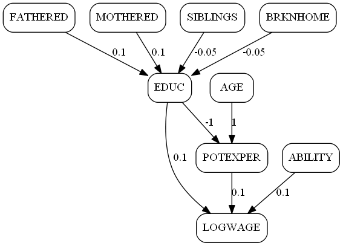

This is what our hypothesized model looks like as a graph,
the Average Direct Effects (ADE). We expect education to
increase by 0.1 years if the father's education increases by one year.
The same should hold for the mother's education. Each sibling is
expected to reduce duration of education by 0.1 years on average.
If the young worker was raised in a broken home, we expect the
education to be half a year shorter on average.

**Average Mediation Effects (AME)**

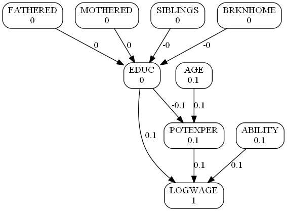

The corresponding Average Mediation Effects (AME) show the effects
on WAGE, our final variable of interest. The structure of the graph
is the same, but all variables are shown with their total effect
with respect to wage. Further, these effects are split up over their
outgoing edges. yielding the mediation effects. Just education has
more than one outgoing edge to be interpreted in this way.

The total effects in the first row are exactly half the direct
effects from the previous graph. This is due to the mediating
education variable directly passing the full effect to wage but
passing the negative effect via potential experience and there
being halved. Note tha this path is due to the fact that longer
education means shorter potential experience. 
In total we expect from the model that one more 
year of education increases hourly wage by 50 Cents. 
One additional year of potential experience is expected to give
the same effect.

**Estimated Mediation Effects (EME)**

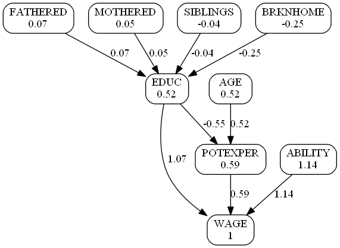

We compare the model effects with the
Estimated Mediation Effects (EME).
All direct effects are close to the expected values, supporting
our model. Interestingly, the effect of potential experience
(59 Cents) is even higher than that of education (57 Cents).
However, one should bear in mind, that the long term effects
of education on wages can not be recovered from this study
focusing on young workers.

**Estimated Mediation Effects (EM0)**

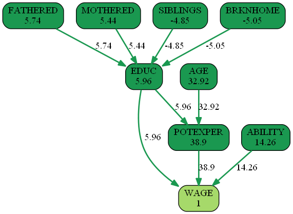


All mediation effects are significantly different
(larger than 2) from zero. That is, all model variables are
highly relevant.

**Estimated Mediation Effects (EM1)**

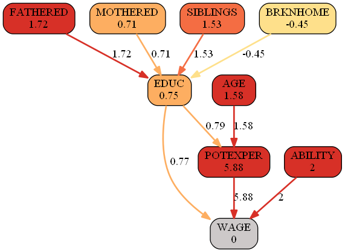

Finally, just one mediation effect is significantly different
from its hypothesized value: There is statistical evidence
that the positive effect of potential experience should be
increased from 50 Cents to 59 Cents.

**Individual Mediation Effects (IME)**

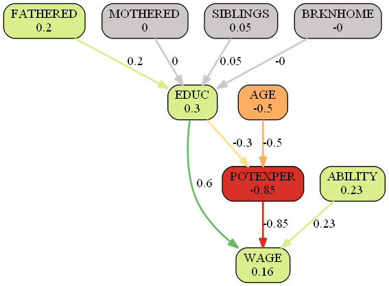

We finally have a look on a single individual. Just for
exposition we analyze the mediation effects of
individual /observation no. 32. This worker is of age 25
and his strongest disadvantage is being so young and having
low potential experience, reducing his wage by 50 Cents.
However, he showed high ability in his test scores 
(+23 Cents). And due to his father's long schooling
(16 years instead of average 12 years) his education
is also above average (13.2 years instead of 12.6 years
in median). In total, this workes achieves an hourly
wage being 16 Cents above average. Note, that these effects
are based on the hypthesized model, not on the estimated
linear approximation.

The observed exogenous and predicted endogenous variables
for individual no. 32 are summraized in the following
table, sorted by their individual total effect on WAGE:

Variable | Rank | Individual 32 | Median | ITE on WAGE
--- | --- | --- | --- | ---
EDUC | 14984 | 13.20 | 12.60 | +0.30
ABILITY | 10936 | 0.44 | 0.21 | +0.23
FATHERED | 14705 | 16.00 | 12.00 | +0.20
WAGE | 9354 | 12.04 | 11.88 | +0.16
SIBLINGS | 3681 | 2.00 | 3.00 | +0.05
MOTHERED | 5043 | 12.00 | 12.00 | 0.00
BRKNHOME | 1 | 0.00 | 0.00 | 0.00
AGE | 6588 | 25.00 | 26.00 | -0.50
POTEXPER | 6338 | 6.80 | 8.50 | -0.85

**Appendix**

We summarize all average and estimated direct, total an mediation effects.

Effects | Direct | Total | Mediation for WAGE
--- | --- | --- | ---
Average effects |  | 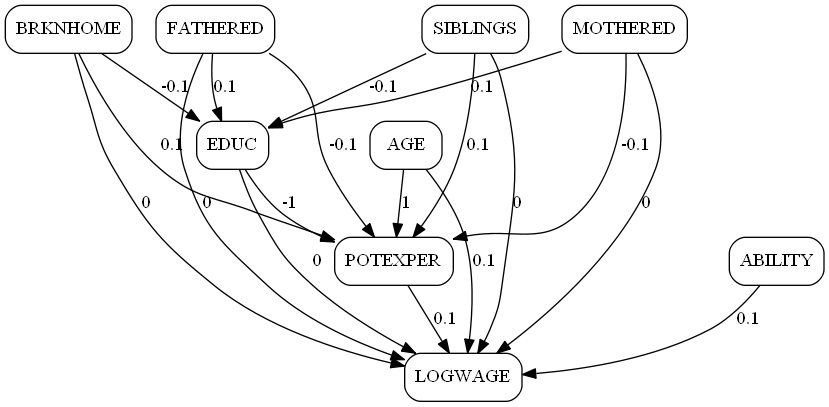 | 
Estimated effects | 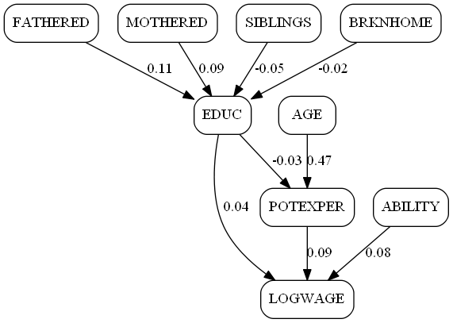 | 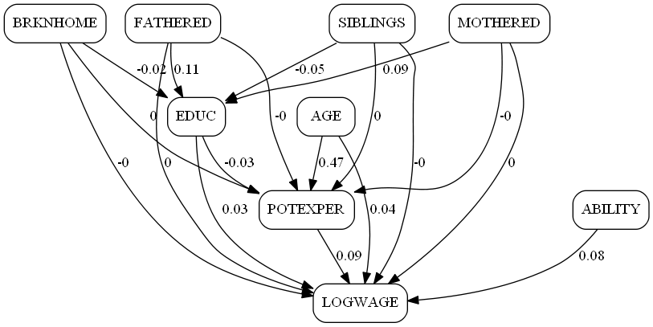 | 

Further, we collect the individual effects corresponding to
observation no. 32.

Effects | Direct | Total | Mediation for WAGE
--- | --- | --- | ---
Individual effects for individual no. 32 | 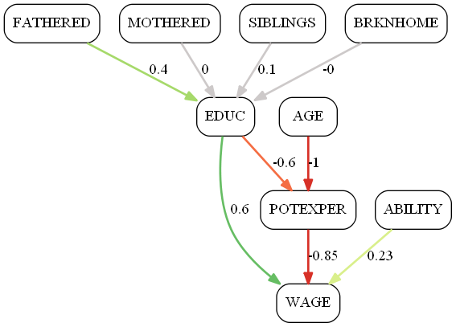 | 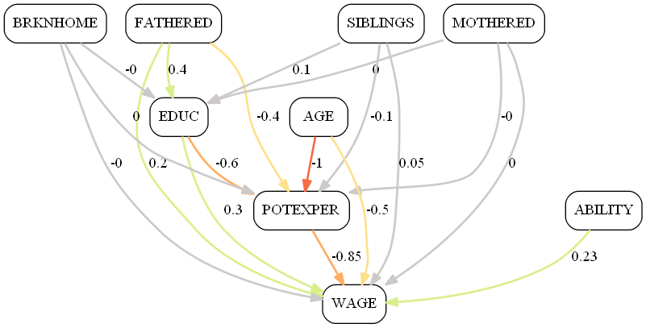 | 

Finally, we present all t-values.

Effects | Direct | Total | Mediation for WAGE
--- | --- | --- | ---
t-values wrt. zero | 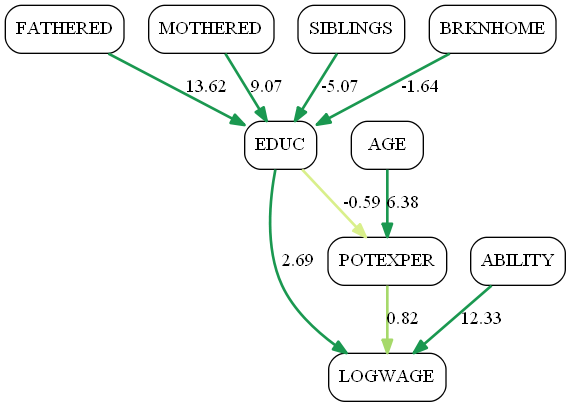 | 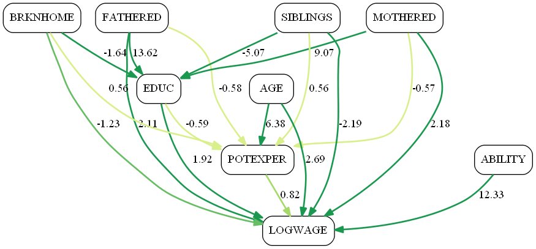 | 
t-values wrt. model | 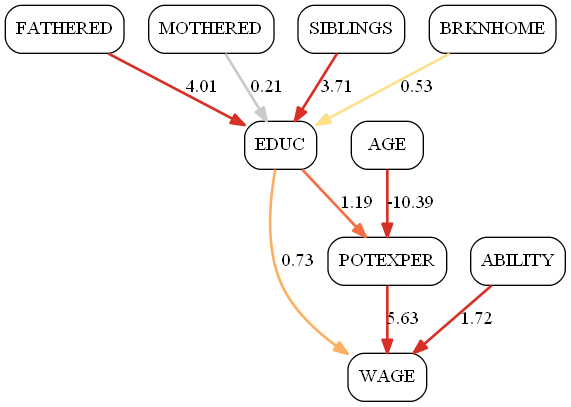 | 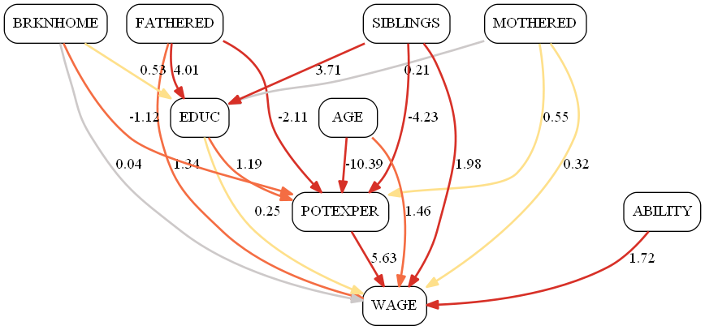 | 

This concludes the example usage of the Causing method
with real world data. We analyzed how wages earned
by young American workers are determined by their educational
attainment, family characteristics, and test scores.
